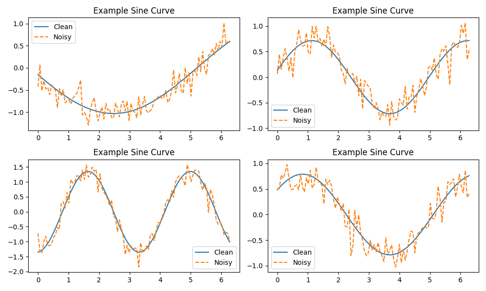
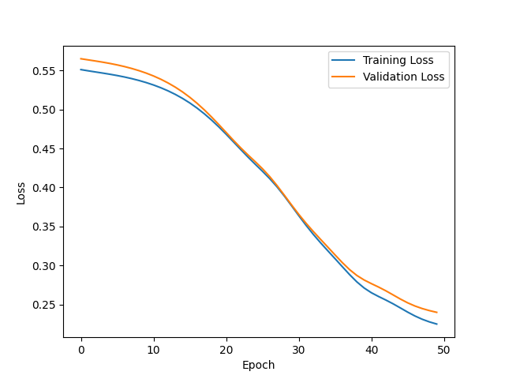
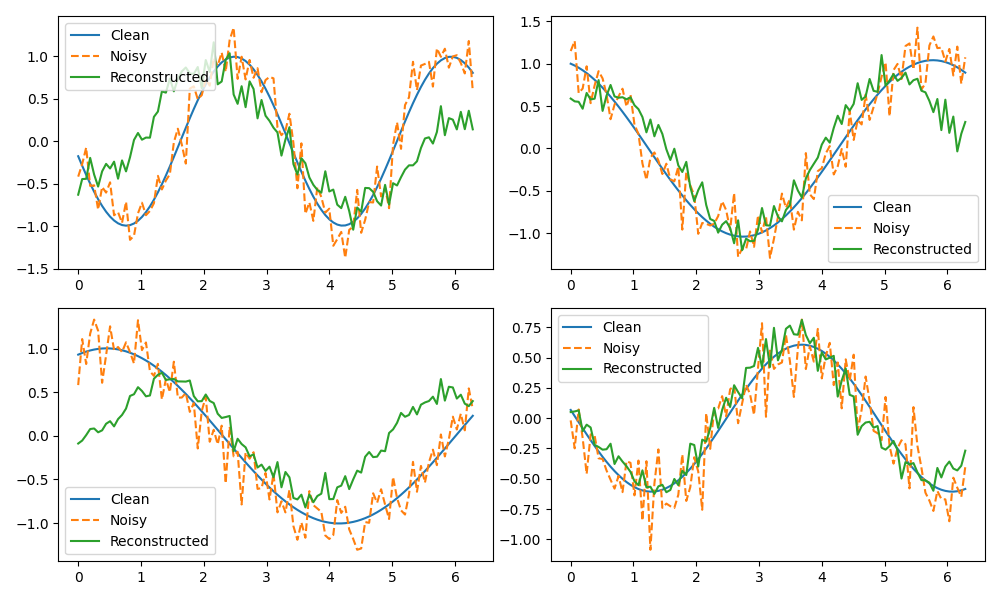

# Denoising Autoencoder for Sine Signals

ASTR 5900 – Computational Astrophysics  
Group Project Homework – My Solution  

## Overview

This project implements a **denoising autoencoder** using PyTorch to reconstruct clean sine wave signals from noisy inputs.

The model learns a compressed representation of the signal and removes Gaussian noise during reconstruction.

## Features

- Synthetic sine wave dataset
- Gaussian noise corruption
- PyTorch autoencoder model
- Training / validation loss tracking
- Signal reconstruction visualization

## Example Results

The model successfully learns to recover the underlying sine signal structure despite significant noise.

### Noisy vs Clean Signals

### Training vs Validation Loss

### Signal Reconstruction

## Technologies

- Python
- PyTorch
- NumPy
- Matplotlib

